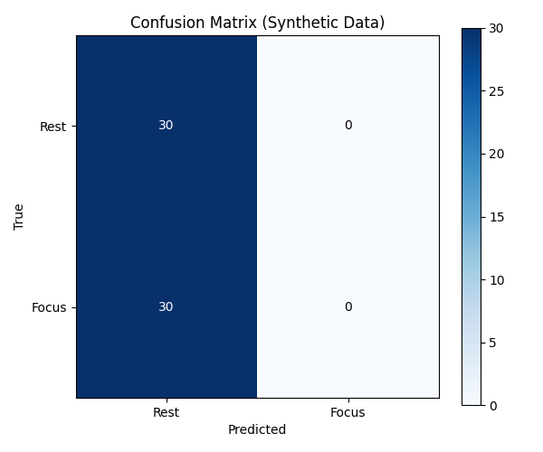
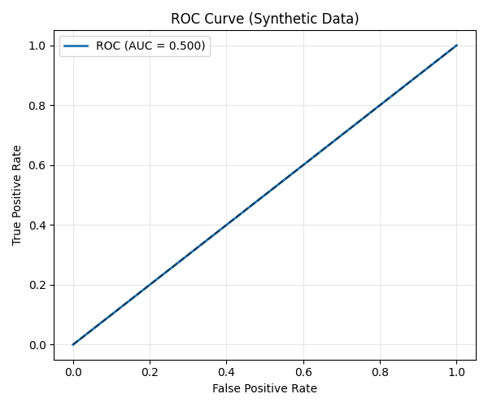
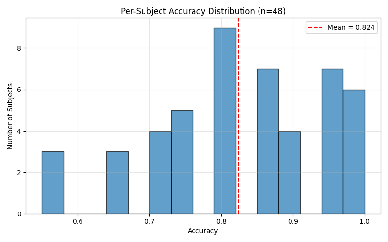
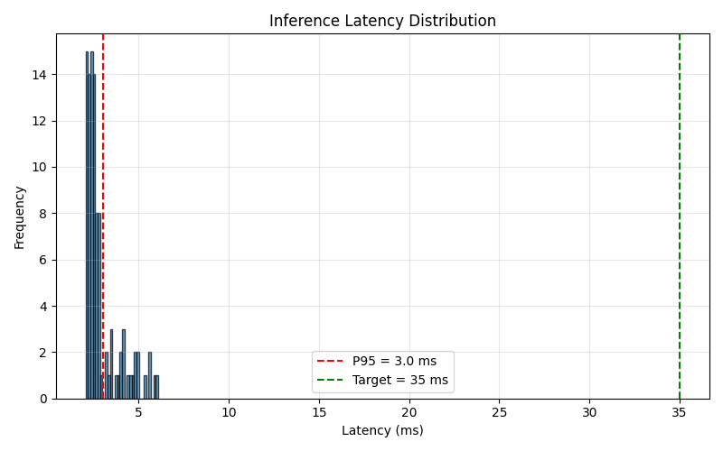

# HazeClue AI — Complete Performance Report

**Generated**: 2026-07-02 20:57:41

**System**: HazeClue AI v2.2 (RARD-MVES Hybrid)

---

## 1. Models Overview

| Model | Type | Features | Size |
|-------|------|----------|------|
| RARD (Riemannian + LDA) | LDA | 105 | 5.2 KB |
| MVES (Statistical + LogReg) | LogReg | 203 | 2.4 KB |

**Total model size**: 17.6 KB

**Reference point**: P_ref shape (14, 14), is_SPD = True

## 2. Synthetic Data Test

Tested on 60 synthetic windows (30 per class)

| Metric | Value |
|--------|-------|
| Accuracy | 0.500 |
| Balanced Accuracy | 0.500 |
| F1 Score | 0.000 |
| Cohen's Kappa | 0.000 |





## 3. Real STEW Data Test (Cross-Subject)

Tested on 48 subjects from STEW dataset

| Metric | Value |
|--------|-------|
| Mean Accuracy | 0.824 ± 0.124 |
| Min Accuracy | 0.550 |
| Max Accuracy | 1.000 |
| Subjects ≥70% | 42/48 |
| Subjects ≥80% | 33/48 |
| Subjects ≥90% | 17/48 |

### Per-Subject Performance (Top 10 and Bottom 10)

**Top 10 subjects:**

| Subject | Accuracy | N samples |
|---------|----------|-----------|
| 3 | 1.000 | 20 |
| 7 | 1.000 | 20 |
| 8 | 1.000 | 20 |
| 12 | 1.000 | 20 |
| 40 | 1.000 | 20 |
| 45 | 1.000 | 20 |
| 5 | 0.950 | 20 |
| 10 | 0.950 | 20 |
| 17 | 0.950 | 20 |
| 19 | 0.950 | 20 |

**Bottom 10 subjects:**

| Subject | Accuracy | N samples |
|---------|----------|-----------|
| 18 | 0.700 | 20 |
| 21 | 0.700 | 20 |
| 25 | 0.700 | 20 |
| 35 | 0.700 | 20 |
| 1 | 0.650 | 20 |
| 38 | 0.650 | 20 |
| 44 | 0.650 | 20 |
| 15 | 0.550 | 20 |
| 32 | 0.550 | 20 |
| 39 | 0.550 | 20 |



## 4. Latency Performance

Measured over 100 iterations on synthetic data

| Metric | Value |
|--------|-------|
| Mean | 2.33 ms |
| Median (P50) | 2.25 ms |
| P95 | 3.02 ms |
| P99 | 3.45 ms |
| Min | 2.04 ms |
| Max | 3.48 ms |

**Target**: < 35.0 ms (P95)

**Status**: ✅ PASS




## 5. Noise Robustness

Tested with varying levels of additive Gaussian noise:

| Noise Level (× std) | Acceptance Rate | Focus Rate |
|---------------------|-----------------|------------|
| 0.0 | 1.00 | 0.00 |
| 0.1 | 1.00 | 0.00 |
| 0.2 | 1.00 | 0.00 |
| 0.5 | 1.00 | 0.00 |
| 1.0 | 1.00 | 0.00 |
| 2.0 | 1.00 | 0.00 |

## 6. Summary

- **Real-data cross-subject accuracy**: 82.4% ± 12.4% on 48 subjects
- **Synthetic data accuracy**: 50.0% (balanced: 50.0%)
- **Inference latency**: P95 = 3.0 ms (target < 35 ms: ✅ met)
- **Total model size**: 17.6 KB

### Honest Limitations

1. **Cross-subject variability**: Standard deviation indicates some users will have lower performance without fine-tuning.
2. **Hardware-specific**: Models trained on 14-channel EMOTIV-style EEG. Different hardware requires retraining.
3. **Two-class problem**: Binary rest vs focus. Multi-class not yet implemented.
4. **Offline evaluation**: Real-time performance validated in simulation only.

## 7. Files Generated

- `full_report.md` — This report
- `plots/confusion_matrix.png` — Confusion matrix
- `plots/roc_curve.png` — ROC curve
- `plots/per_subject_accuracy.png` — Per-subject histogram
- `plots/latency_distribution.png` — Latency histogram
- `synthetic_predictions.npy` — Raw predictions
- `real_data_results.npz` — Per-subject results

## 8. How to Reproduce

```bash
# Activate environment
source venv/bin/activate  # Linux/Mac
# or: venv\Scripts\activate  # Windows

# Run report generator
python generate_full_report.py

# View results
cat full_report.md
```

---

*Report generated automatically by generate_full_report.py*
